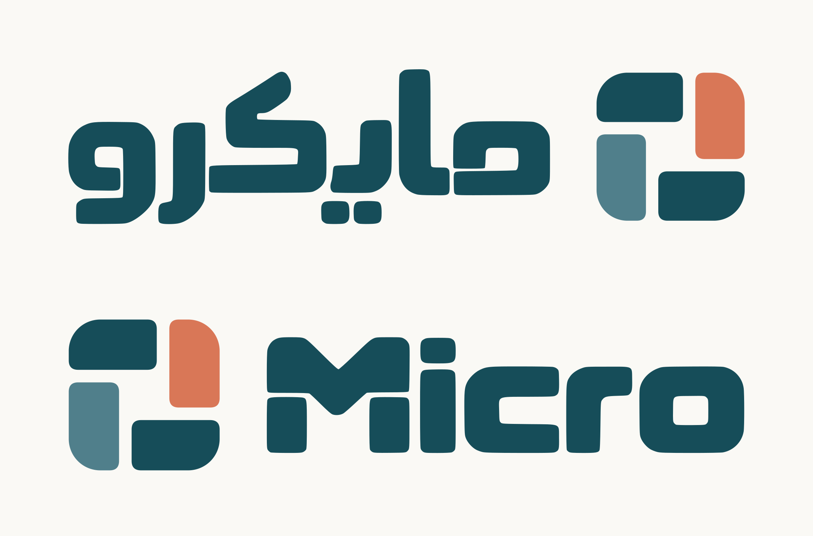

# Micro — الشعار المعتمد

**APPROVED BY OWNER — 2026-10-07.** اعتمد قيس الشعار الذي سُلّم في هذه المحادثة، وطلب حفظ كل ملفاته في مستودع UI على main. هذا المجلد هو مدخل الرجوع إليه.

## الملفات الأساسية

- [المصدر المتجهي الوحيد القابل للتعديل](v1/source/micro-brand-master.svg): الرمز والتركيب العربي والإنجليزي؛ الحروف مسارات وليست خطًا مثبتًا.
- [دليل الاستخدام والتعديل](v1/README-AR.md) و[أداة إعادة التصدير](v1/tools/export_brand.py).
- [SVG](v1/exports/svg/) و[PNG شفاف](v1/exports/png/) و[PDF RGB](v1/exports/pdf/): نسخ ملونة وأحادية وبيضاء بحسب الصيغة.
- [الرمز وحده للهاتف 2048×2048 بخلفية فاتحة](v1/phone/micro-symbol-light-2048.png)، [شفاف](v1/phone/micro-symbol-transparent-2048.png)، و[SVG](v1/phone/micro-symbol.svg).
- [حزمة التسليم الأصلية ZIP](v1/download/micro-brand-source-v1.zip): نسخة التسليم الأساسية كما أُرسلت؛ صور الهاتف محفوظة خارجها أيضًا في هذا المجلد.
- [فحص الهندسة والتحويل](v1/docs/vector-validation.json)، [فحص التوافق](v1/docs/delivery-checks.json)، و[معاينة الأحجام الصغيرة](v1/docs/small-size-proof.png).
- [التطوير المؤجل](FUTURE-DEVELOPMENT.md).

## القرار وحدوده

اعتماد الشعار يشمل الشكل والألوان الثلاثة والكتابة الهندسية ذات الفواصل في النسخة المسلّمة. 

الألوان: بترولي `#164D59`، تراكوتا `#D97757`، بترولي أزرق `#507F8B`. لا يغيّر حفظ هذه الأصول توكنات UI الحالية أو خطوط واجهة التطبيق. اختيار اللون الذي سيُستبدل بالتراكوتا على مستوى النظام مؤجل.

القطع الأربع متطابقة هندسيًا بدورانات قائمة. الحروف أُعيدت كمسارات من المرجع المختار مع ضبط بصري للمسافات؛ ليست ملف خط TTF/OTF. لا تُعدّل مشتقات PNG بدل المصدر.

حالة الشعار APPROVED منفصلة عن حالة مراجعات UI/UX القائمة. الطباعة الفعلية وملفات ICC/CMYK وفحص العلامات التجارية ليست منجزة بهذا الحفظ. لم يُركّب الشعار في الشاشات.

## البصمات

`v1/SHA256.json` يخص حزمة التسليم الأصلية. `v1/ARCHIVE-SHA256.json` يغطي ملفات أرشيف v1 الموسع، باستثناء نفسه. MANIFEST في جذر المستودع يغطي ملفات المجلد ووثائقه.
